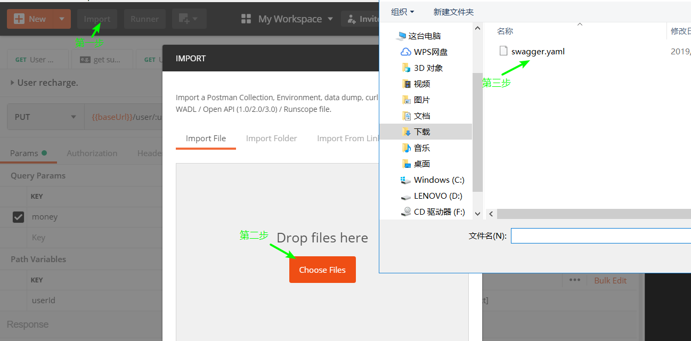
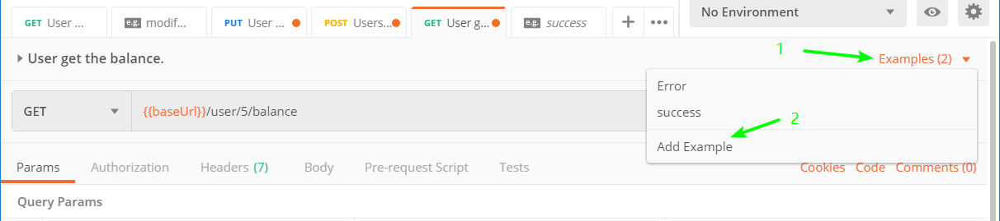
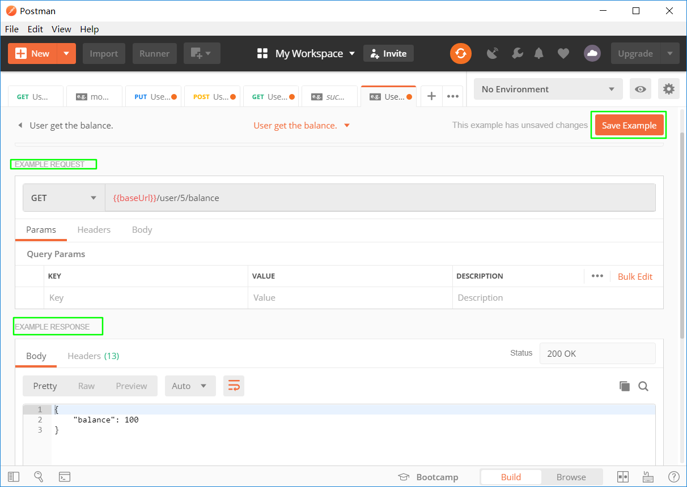

# Postman高级应用之Mock服务

## 场景

在生成API接口文档后，前端团队往往不满足于接口文档，而需要对接真实的数据，但这样受限于后端开发进度，于是便有了Mock，实现前后端分离，让前端攻城师独立于后端进行开发。下面我将介绍接口调试利器Postman中的Mock服务。

## 建立

1. Postman提供的Mock Server方式有两种：
    1. 新建API
    2. 使用工作区的集合

也就是需要先建立好API接口文档后才能搭建Mock Server，这里API文档我使用Swagger编写并生成yaml文件，再在Postman中import便可得到集合。

2. 在产生的集合里添加Mock，输入名称即可建立，然后将得到的地址作为服务器地址即可。

3. 然后对于每个API添加示例的请求和响应即可，就可以在请求后获得已编写好的响应。

## 私有Mock Server

1. 在创建mock的界面，有一项时`Make this mock server private`。如果没有勾选，那么生成的mock地址是公开的，谁都可以访问，可能会造成不必要的麻烦。

2. 设为私有后会有以下的操作，也就是获取一个密钥，并将密钥加入到请求的头部即可。

