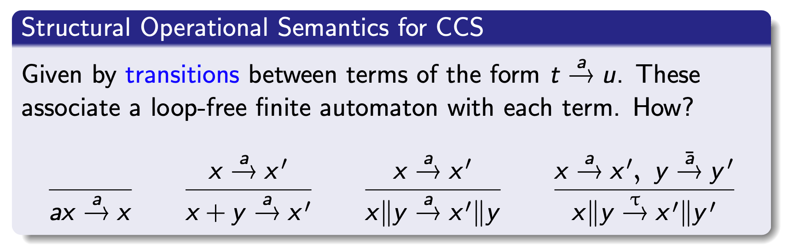

# lecture1

## 基本概念

形式化方法是基于严格数学基础，对计算机硬件和软件系统进行描述、开发和验证的技术。

1. 构建计算系统的程序理论
2. 计算系统进行形式规约、开发和验证的方法和技术，设计算法和建立工具
3. 开展上述方法应用的过程

## 程序理论

1. 形式语言：Chomsky 文法、自动机理论· · ·
2. 形式语义学：操作语义、指称语义、代数语义、公理语义
3. 形式模型：逻辑、自动机、进程代数、Petri网

## 形式规约

使用形式语言构建所开发的软件系统的规约，对应于软件生命周期不同阶段的制品，刻画系统不同抽象层次的模型和性质

### 模型规约语言

Alarm Clock：基于迁移系统的规约

1. 结构化规约语言
2. 代数规约语言
3. 进程代数

### 性质规约语言

1. 断言语言：Hoare Tripes
   $$
   \{\text { Pre }\} \text { P \{Post }\}
   $$
   1. 部分正确性
   2. 完全正确性
2. VDM描述
3. 时序逻辑语言
   1. 时序逻辑：用来表达时间序列上的逻辑（PTL、CTL、ITL、XYZ、DC等）

### 形式语言学

1. 操作语义：使用抽象解释器（抽象机或抽象函数）定义语言语义，着重模拟暑假加工过程中计算机系统的操作。
   
2. 指称语义：将语言的基本语法成分解释成为数学对象（称为指称），用数学对象上的运算来定义语言的语义。
   
3. 代数语义
   1. 用代数结构来定义计算机语言（特别是代数规约语言）的语义，源自抽象数据类型
   2. 满足抽象数据类型公理的模型就是这个抽象数据类型的一个代数语义
   3. 利用模型论和范畴论方法来推理该语言的程序性质
4. 公理语义
   1. 使用形式逻辑来描述程序的语义
   2. 在已有的形式逻辑系统的基础上增加所有程序必须满足的基本命题（程序公理）
   3. 与断言逻辑一起构成程序逻辑的证明系统
   
5. 比较

||数学基础|语义特点|使用场景|
|----|----|----|----|
|操作语义|自动机|易扩充|语言实现、模型检验|
|指称语义|论语理论|表达能力强|语言设计、统一理论、规约精化|
代数语义|代数理论|代数规约|重写执行、规约精化|
|公理语义|程序逻辑|证明强|演绎推理|

## 形式验证

证明不同形式规约之间的逻辑关系，这些逻辑关系反映了在软件开发不同阶段软件制品之间的需要满足的各类正确性需求

### 定理证明

1. 定理证明框架
   
2. 交互式定理证明（Coq、Isabelle/HOL等）
   1. 利用计算机来解决证明在计算机中的表示问题以及自动检查证明的正确性，证明的构造则由人手工和机器交互
   2. 高阶定理证明，优点在于无需牺牲规约和代码的表达能力，特别是程序规约可以用表达能力很强的逻辑
3. 自动定理证明
   1. 判定性
      1. 命题逻辑是可判定的
      2. 许多时序逻辑是可判定的
      3. 一阶逻辑是半可判定的。

### 符号执行

### 模型检验

通过自动遍历系统模型的有穷状态空间来检验系统的语义模型与其性质规约之间的满足关系

$$
M \models \varphi
$$
* 给定$\varphi, M \models \varphi$是否对所有M都成立？
* 给定$\varphi, M \models \varphi$是否对有的M都成立？
* 给定$\varphi$和$M$, $M \models \varphi$是否成立？

1. 空间保证的对策
   1. 结构化方法
   2. 符号化方法
   3. 抽象方法（上近似）
   4. 限界

### 抽象解释

## 形式开发

构造、证明形式规约之间的等价转换和精化关系，以系统的形式模型为指导，逐步精化，开发出满足需要的系统，也称为构造即正确的开发/形式综合（synthesis）。