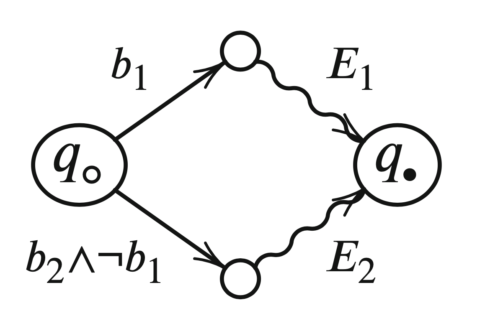
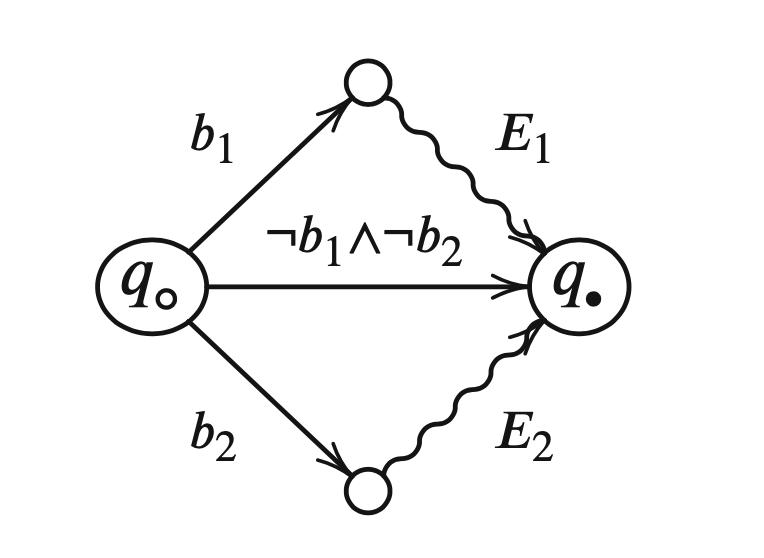
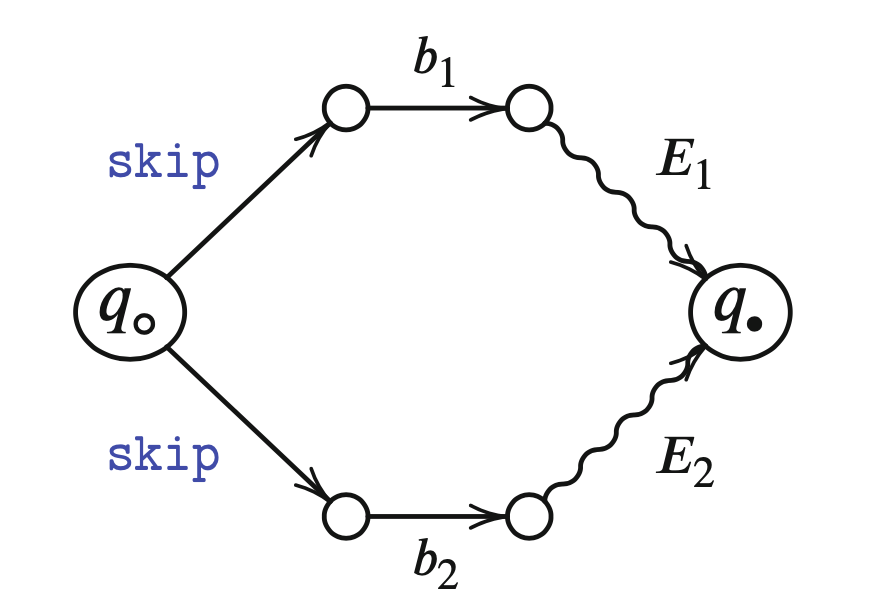

# chapter3 卫兵命令

## 语法

卫兵命令/Guarded Commands

$$
G C::=b \rightarrow C \mid G C_{1}[] G C_{2}
$$

## 从程序构造程序图

### 边的构造

对于卫兵命令程序C，有$edges (\cdot \rightsquigarrow \cdot) \llbracket \cdot \rrbracket$计算

$\operatorname{edges}\left(q_{\triangleright} \rightsquigarrow q_{\blacktriangleleft}\right) \llbracket C \rrbracket$

其中，$q_{\triangleright} \neq q_{\blacktriangleleft}$

* 命令边的构造
* 卫兵命令边的构造

$$
\begin{aligned}
\operatorname{edges}\left(q_{\circ} \rightsquigarrow q_{\bullet}\right) \llbracket \text { do } G C  \text{od} \rrbracket=& \text { let } b=\operatorname{done} \llbracket G C \rrbracket \\
E &=\operatorname{edges}\left(q_{\circ} \rightsquigarrow q_{\circ}\right)\llbracket G C \rrbracket\\
& \text { in } E \cup\left\{\left(q_{\circ}, b, q_{\bullet}\right)\right\}
\end{aligned}
$$

其中

$$
\begin{aligned}
\text { done } \llbracket b \rightarrow C \rrbracket &=\neg b \\
\text { done } \llbracket G C_{1} [] G C_{2} \rrbracket &=\text { done } \llbracket G C_{1} \rrbracket \wedge \text { done } \llbracket G C_{2} \rrbracket
\end{aligned}
$$

### 生成程序图

从边构成edges到程序图

edges : $((\mathbf{Q} \rightarrow \mathbf{Q}) \rightarrow$ Prog $) \rightarrow 2^{\mathbf{E}}$

如下生成程序图PG：

* Q：从E提取
* $q_{\triangleright}, q_{\blacktriangleleft} \in \mathbf{Q}$：分别是初始结点、终止结点
* ACT：动作集合从E提取
* $\left.\mathbf{E}=\operatorname{edges}(q_{\triangleright} \rightsquigarrow q_{\bullet}\right) \llbracket \cdot\rrbracket$：有穷边集。$\left(q_{\circ}, \alpha, q_{\bullet}\right)$ 中， $q_{\circ}$ 是源结点, $q_{\bullet}$是目标结点, $\alpha$ 是标注的动作。

### 程序图的性质

$q_{\blacktriangleleft}$ 不是 $edges \left.(q_{\triangleright} \rightsquigarrow q_{\blacktriangleleft}\right) \llbracket C \rrbracket$ 任何边的首元素

## 语义

* 语义域
    $$
    \mathrm{Mem}=\text { Var } \rightarrow \text { Int }
    $$
* 语义函数
    $$
    \mathcal{S} \llbracket \cdot \rrbracket=\mathbf{A C T} \rightarrow(\mathbf{M e m} \hookrightarrow \text { Mem })
    $$

### 扩充数组

* 扩充边的构造
    $$
    \mathbf{e d g e s}\left(q_{\circ} \rightsquigarrow q_{\bullet}\right) \llbracket A\left[a_{1}\right]=a_{2} \rrbracket=\left\{\left(q_{\circ}, A\left[a_{1}\right]=a_{2}, q_{\bullet}\right)\right\}
    $$
* 扩充语义函数
    $$
    \text { Mem }=(\operatorname{Var} \cup\{A[i] \mid A \in \text { Arr }, 0 \leq i<\operatorname{length}(A)\}) \rightarrow \text { Int }
    $$
$$
\mathcal{S} \llbracket A\left[a_{1}\right]:=a_{2} \rrbracket \sigma=\left\{\begin{array}{ll}
\sigma\left[A\left[z_{1}\right] \mapsto z_{2}\right] & \text { if } \left.z_{1}=\mathcal{A} \llbracket a_{1}\right] \sigma \\
& \text { and } z_{2}=\mathcal{A}\left[a_{2} \rrbracket \sigma\right. \\
& \text { and } A\left[z_{1}\right] \in \operatorname{dom}(\sigma) \\
\text { undefined } & \text { otherwise }
\end{array}\right.
$$

## 语义变种

### 卫兵的确定版本

$$
\begin{array}{l}
\operatorname{edges}_{d 2}\left(q_{\circ} \rightsquigarrow q_{\bullet}\right) \llbracket b \rightarrow C \rrbracket(d) \\
=\quad \text { let } q \text { be fresh } \\
\qquad \begin{aligned}
E=\text { edges }_{d}\left(q \sim q_{\bullet}\right)[C \rrbracket
& \text { in }\left(\left\{\left(q_{\circ}, b \wedge \neg d, q\right)\right\} \cup E, b \vee d\right)
\end{aligned}
\end{array}
$$

### 卫兵的非阻塞版本

$$
\begin{aligned}
\operatorname{edges}_{e}\left(q_{\circ} \rightsquigarrow q_{\bullet}\right)[\text { if } G C \mathrm{fi} \rrbracket=& \text { let } b=\operatorname{done} \llbracket G C \rrbracket \\
&\left.E=\operatorname{edges}_{e}\left(q_{\circ} \rightsquigarrow q_{\bullet}\right) \llbracket G C\right] \\
& \text { in } E \cup\left\{\left(q_{\circ}, b, q_{\bullet}\right)\right\}
\end{aligned}
$$

其中

$$
\begin{aligned}
\text { done } \llbracket b \rightarrow C \rrbracket &=\neg b \\
\text { done } \llbracket G C_{1} \rrbracket G C_{2} \rrbracket &=\text { done } \llbracket G C_{1} \rrbracket \wedge \text { done } \llbracket G C_{2} \rrbracket
\end{aligned}
$$

### 卫兵的内部选择版本

$$
\begin{array}{l}
\text { edges }_{i}\left(q_{\circ} \rightsquigarrow q_{\bullet}\right) \llbracket G C_{1}[] G C_{2} \rrbracket=\text { let } q_{1} \text { and } q_{2} \text { be fresh }\\
\begin{array}{l}
E_{1}=\operatorname{edges}_{i}\left(q_{1} \rightsquigarrow q_{\bullet}\right) \llbracket G C_{1} \rrbracket \\
E_{2}=\text { edges }_{i}\left(q_{2} \rightsquigarrow q_{\bullet}\right) \llbracket G C_{2} \rrbracket \\
\text { in }\left\{\left(q_{\circ}, \text { skip, } q_{1}\right),\left(q_{\circ}, \text { skip, } q_{2}\right)\right\} \cup E_{1} \cup E_{2}
\end{array}
\end{array}
$$

## 扩展控制结构

### 扩展循环控制

### 扩展异常机制

$$
\begin{array}{l}
\text { edges } \left._{x 2}\left(\rightsquigarrow q_{\bullet}\right) \llbracket e: C\right] \gamma=\text { let } q \text { be fresh }
\begin{array}{l}
E=\operatorname{edges}_{\mathrm{X}}\left(q \rightsquigarrow q_{\bullet}\right) \llbracket C \rrbracket \gamma 
\text { in }(E, \gamma[e \mapsto q])
\end{array}
\end{array}
$$

$$
\begin{array}{r}
\text { edges }_{\times 2}\left(\rightsquigarrow q_{\bullet}\right) \llbracket H C_{1}\left[H C_{2}\right] \gamma=\text { let } \begin{array}{r}
\left(E_{1}, \gamma_{1}\right)=\text { edges }_{\times 2}\left(\rightsquigarrow q_{\bullet}\right) \llbracket H C_{1} \rrbracket \gamma \\
\left(E_{2}, \gamma_{2}\right)=\text { edges }_{\times 2}\left(\rightsquigarrow q_{\bullet}\right) \llbracket H C_{2} \rrbracket \gamma_{1} \\
\text { in }\left(E_{1} \cup E_{2}, \gamma_{2}\right)
\end{array}
\end{array}
$$

$$
\begin{array}{l}
\text { edges }_{x}\left(q_{\circ} \rightsquigarrow q_{\bullet}\right)[\text { try } C \text { catch } H C \text { yrt } \rrbracket \gamma= 
\text { let }\left(E^{\prime}, \gamma^{\prime}\right)=\text { edges }_{x 2}\left(\rightsquigarrow q_{\bullet}\right) \llbracket H C \rrbracket \gamma \\
E=\operatorname{edges}_{x}\left(q_{\circ} \rightsquigarrow q_{\bullet}\right) \llbracket C \rrbracket \gamma^{\prime} \\
\text { in } E \cup E^{\prime}
\end{array}
$$

$$
\begin{array}{l}
\text { edges }_{\mathrm{X}}\left(q_{\circ} \rightsquigarrow q_{\bullet}\right)[\text { throw } e \rrbracket \gamma= 
\left\{\begin{array}{ll}
\left\{\left(q_{0}, \mathrm{skip}, q\right)\right\} & \text { where } q=\gamma(e) \\
\emptyset & \text { if } e \notin \operatorname{dom}(\gamma)
\end{array}\right.
\end{array}
$$