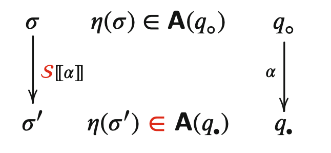
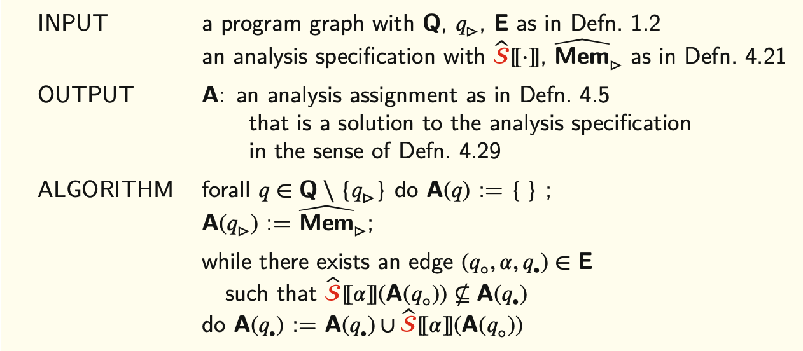
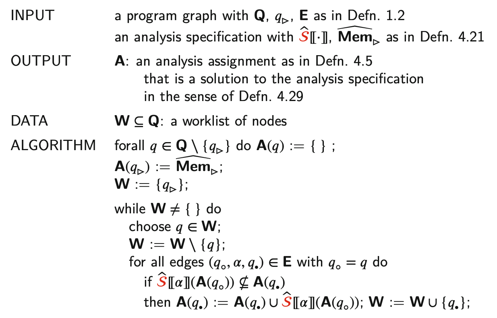

# chapter5 程序分析

## 抽象性质

### 内存模型

* 具体内存
    $$
    \sigma \in \operatorname{Mem}=(\operatorname{Var} \cup\{A[i] \mid A \in \text { Arr }, 0 \leq i<\operatorname{size}(A)\}) \rightarrow \text { Int }
    $$
* 抽象内存
    $$
    \left(\hat{\sigma}_{1}, \hat{\sigma_{2}}\right) \in \widehat{\mathrm{Mem}}=(\text { Var } \rightarrow \text { Sign }) \times\left(\text { Arr } \rightarrow 2^{\text {Sign }}\right)
    $$
* 提取函数
    $$
    \eta: \mathrm{Mem} \rightarrow \widehat{\mathrm{Mem}}
    $$

## 分析赋值

### 上近似/Overapproximation

分析赋值：建立程序图节点域抽象内存的映射
$$
\text { A : } \mathrm{Q} \rightarrow 2^{\widehat{\text { Mem }}}
$$

关于语义$\mathcal{S} \llbracket \cdot \rrbracket$的正确分析赋值
* 若$\left(q_{\circ}, \alpha, q_{\bullet}\right) \in \mathbf{E}$，有对所有$\sigma$
    $$
    \left(\eta(\sigma) \in \mathbf{A}\left(q_{\circ}\right) \wedge \sigma^{\prime}=\mathcal{S} \llbracket \alpha \rrbracket \sigma\right) \Rightarrow \eta\left(\sigma^{\prime}\right) \in \mathbf{A}\left(q_{\bullet}\right)
    $$
* 若$\sigma \in \mathbf{M e m}_{\triangleright}$，有$\eta(\sigma) \in \mathbf{A}\left(q_{\triangleright}\right)$

### 语义正确性

#### 语义正确的分析赋值

设A是语义正确的分析赋值。若
$$
\eta(\sigma) \in \mathbf{A}\left(q_{\circ}\right) \text { 且 }\left\langle q_{\circ} ; \sigma\right\rangle \stackrel{\omega}{\Longrightarrow}^{*}\left\langle q_{\bullet} ; \sigma^{\prime}\right\rangle
$$
则
$$
\eta\left(\sigma^{\prime}\right) \in \mathbf{A}\left(q_{\bullet}\right)
$$

## 分析函数

抽象语义

## 分析规约/Analysis Specification

* 语义域->分析域
* 语义函数->分析函数

### 语义可靠性

可靠性：程序分析规范关于语义$\mathcal{S} \llbracket \cdot \rrbracket$、初始内存集合$Mem _{\triangleright}$和抽取函数$\eta: \mathrm{Mem} \rightarrow \widehat{\mathrm{Mem}}$是可靠的，如果以下条件成立：
* 若$\sigma^{\prime}=\mathcal{S}[\alpha \rrbracket(\sigma)$且$\eta(\sigma) \in M$，则
    $$
    \eta\left(\sigma^{\prime}\right) \in \hat{\mathcal{S}} \llbracket \alpha\rrbracket(M)
    $$
* 若$\sigma \in \mathbf{M e m}_{\triangleright}$，则$\eta(\sigma) \in \widehat{\mathrm{Mem}_{\triangleright}}$

### 符号分析的可靠性

假设当$\sigma \in \mathbf{M e m}_{\triangleright}$ 则 $\eta(\sigma) \in \widehat{\mathbf{M e m}_{\triangleright}}$。符号分析规范相对于前述语义是语义可靠的。

### 计算有效的分析赋值

若分析赋值$A: Q \rightarrow 2^{\widehat{M e m}}$满足以下两个条件
* 对$\left(q_{\circ}, \alpha, q_{\bullet}\right) \in \mathbf{E}$均有
    $$
    \hat{\mathcal{S}} \llbracket \alpha \rrbracket\left(\mathbf{A}\left(q_{\circ}\right)\right) \subseteq \mathbf{A}\left(q_{\bullet}\right)
    $$
* $\widehat{{M e m}_{\triangleright}} \subseteq \mathbf{A}\left(q_{\triangleright}\right)$

### 正确性

#### 求解正确性

* 分析赋值是语义正确的
* 分析规范是语义可靠的
* 分析赋值是计算有效的

#### 三者的关系

假设我们有语义可靠的分析规范和一个计算有效的分析赋值，则该分析赋值时语义正确的。

## 计算求解

### Choatic Iterations

### Worklist Iterations
