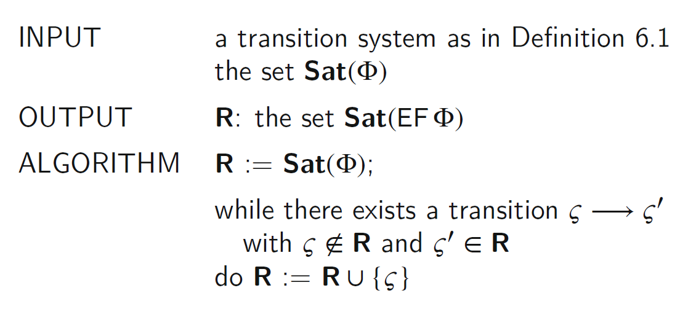
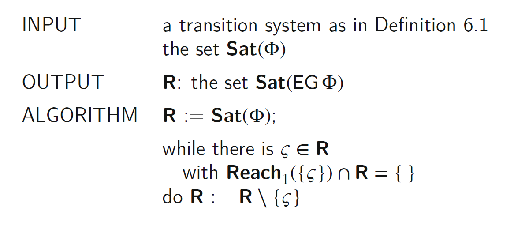
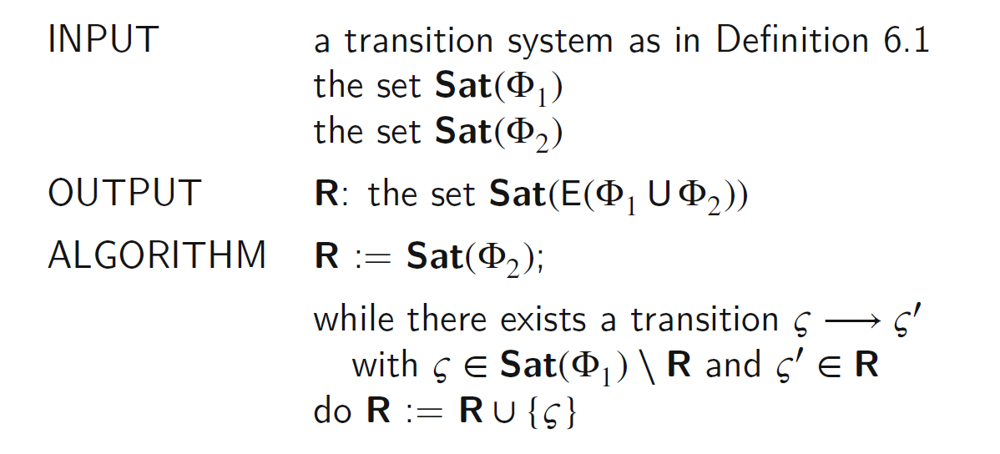

# chapter7 模型检验

## Transition Systems

* 程序图和内存
  * 程序图program graph代表程序的控制结构
  * 内存memories代表数据结构
  * 格局configurations表示状态
  * 语义semantics定义了格局间的执行步
* 转变系统的状态结合了程序图和内存。

### 定义TS

* $S$：状态的非空集合
* $I \subseteq \mathbf{S}$：初始状态的非空集合
* $\rightarrow \subseteq \mathbf{S} \times \mathbf{S}$：转变关系，$\left(\varsigma, \varsigma^{\prime}\right) \in \rightarrow$写作$\varsigma \rightarrow \varsigma^{\prime}$
* $AP$：原子命题的集合
* $\mathrm{L}: \mathrm{S} \rightarrow PowerSet(AP)$：状态的标签函数

### 路径及可达性

* The stuck state：没有转变关系离开该状态
* Path：状态序列$\varsigma_{0} \varsigma_{1} \ldots \varsigma_{n-1} \varsigma_{n} \cdots$
  * 路径尽可能长
  * 路径是有限的仅当其以stuck state终止
  * 路径片段可以不尽可能长
* 符号Notations
  * $\operatorname{Path}\left(\varsigma_{0}\right)$：以$\varsigma_0$开始的路径集合
  * $\operatorname{Reach}_1\left(S_{0}\right)$：从$S_0$的一些状态一步可达的状态
  * $\operatorname{Reach}\left(S_{0}\right)$：从$S_0$的一些状态零步或多步可达的状态
  * $\operatorname{Reach}\left(I\right)$：可达的状态

## Computation Tree Logic（CTL）

### 原子命题

* 命题在一个状态持有当其是该状态的一个标签，即$\text { ap } \in \mathrm{L}(s)$
* $\varsigma \vDash \Phi$说明$Phi$在状态$\varsigma$中持有，或者$\varsigma$满足公式$Phi$

### 原子命题的可达性

* $\mathrm{EX} \Phi$：某个情况下下一步可达
* $\mathrm{AX} \Phi$：所有情况下下一步可达
* $\mathrm{EF} \Phi$：某个情况下多步后可达
* $\mathrm{AF} \Phi$：所有情况下多步后可达
* $\mathrm{EG} \Phi$：某个情况下所有状态满足该命题
* $\mathrm{AG} \Phi$：所有情况下所有状态满足该命题

### CLT命题总结

||X one step|F some state|G always|
|--|---|--|--|
|E possible|EX$\Phi$|EF$\Phi$|EG$\Phi$|
|A unavoidable|AX$\Phi$|AF$\Phi$|AG$\Phi$|

## CTL语法和语义

### 语法

* 状态公式
* 路径公式

    $$
    \Phi::=\mathrm{tt}|\mathrm{ap}| \Phi_{1} \wedge \Phi_{2}|\neg \Phi| E \Psi \mid \mathrm{A} \Psi
    $$

    $$
    \Psi::=X \Phi|F \Phi| G \Phi \mid \Phi_{1} \cup \Phi_{2}
    $$

### 语义

## 从程序图到转变系统

将格局考虑成转变系统的状态，包括程序点和内存

* S：格局集合$\langle q ; \sigma\rangle \in \mathbf{Q} \times$ Mem
* I：$\left\langle q_{\triangleright} ; \sigma\right\rangle$的集合
* $\rightarrow$：当语义满足$\langle q ; \sigma\rangle \stackrel{\alpha}{\Rightarrow}\left\langle q^{\prime} ; \sigma^{\prime}\right\rangle$时，有$\langle q ; \sigma\rangle \rightarrow\left\langle q^{\prime} ; \sigma^{\prime}\right\rangle$
* AP有三种命题：
  * $@ q$ for node $q \in \mathbf{Q}$
  * $\# \sigma$ for memory $\sigma \in$ Mem
  * $\triangleright$ and $\blacktriangleleft$
* $L(\langle q ; \sigma\rangle)=\left\{\begin{array}{l}\left\{@_{q}, \#_{\sigma}, \triangleright\right\} \text { if } q=q_{\triangleright} \\ \left\{@_{q}, \#_{\sigma},\blacktriangleleft\right\} \text { if } q=q_{\blacktriangleleft} \\ \left\{@_{q}, \#_{\sigma}\right\} \text { otherwise }\end{array}\right.$

### 根据模型检查属性

## 算法

$$
\operatorname{Sat}(\Phi)=\{\varsigma \mid \varsigma \vDash \Phi\}
$$

* 直接用例

$$
\begin{array}{lll}
\operatorname{Sat}(\mathrm{t}) & = & \mathrm{S} \\
\operatorname{Sat}(\mathrm{ap}) & = & \{\varsigma \in \mathrm{S} \mid \mathrm{ap} \in \mathrm{L}(\mathrm{s})\} \\
\operatorname{Sat}\left(\Phi_{1} \wedge \Phi_{2}\right) & = & \operatorname{Sat}\left(\Phi_{1}\right) \cap \operatorname{Sat}\left(\Phi_{2}\right) \\
\operatorname{Sat}(-\Phi) & = & \mathbf{S} \backslash \operatorname{Sat}(\Phi)
\end{array}
$$

* 简单用例

$$
\begin{aligned}
\operatorname{Sat}(E X \Phi) &=\left\{\varsigma \mid \operatorname{Reach}_{1}(\{\zeta\}) \cap \operatorname{Sat}(\Phi) \neq\{\}\right\} \\
\operatorname{Sat}(A X \Phi) &=\left\{\varsigma \mid \operatorname{Reach}_{1}(\{\zeta\}) \subseteq \operatorname{Sat}(\Phi)\right\} \\
\operatorname{Sat}(E F \Phi) &=\{\varsigma \mid \operatorname{Reach}(\{\zeta\}) \cap \operatorname{Sat}(\Phi) \neq\{\}\} \\
\operatorname{Sat}(A G \Phi) &=\{\varsigma \mid \operatorname{Reach}(\{\zeta\}) \subseteq \operatorname{Sat}(\Phi)\}
\end{aligned}
$$

### 算法$Sat(EF\Phi)$

### 算法$Sat(AG\Phi)$

$$
A G \Phi \Leftrightarrow \neg(E F(\neg \Phi))
$$

### 算法$Sat(EG\Phi)$

$$
\begin{aligned}
\operatorname{Sat}(E G \Phi)=& \cap_{n} F^{n}(\operatorname{Sat}(\Phi)) \\
& \text { where } F\left(S^{\prime}\right)=\left\{\varsigma \in S^{\prime} \mid \operatorname{Reach}_{1}(\{\zeta\}) \cap S^{\prime} \neq\{\}\right\}
\end{aligned}
$$

### 算法$Sat(AF(\Phi))$

$$
\mathrm{AF} \Phi \quad \Leftrightarrow \neg(\mathrm{EG}(\neg \Phi))
$$

### 算法$Sat(E(\Phi_1 \cup \Phi_2))$

$$
\mathrm{EF} \Phi \Leftrightarrow \mathrm{E}(\mathrm{tt} \cup \Phi)
$$

### 算法$Sat(A(\Phi_1 \cup \Phi_2))$

$$
\neg \mathrm{A}\left(\Phi_{1} \mathrm{U} \Phi_{2}\right) \Leftrightarrow \mathrm{EG}\left(\neg \Phi_{2}\right) \vee \mathrm{E}\left(\neg \Phi_{2} \mathrm{U}\left(\neg \Phi_{1} \wedge \neg \Phi_{2}\right)\right)
$$