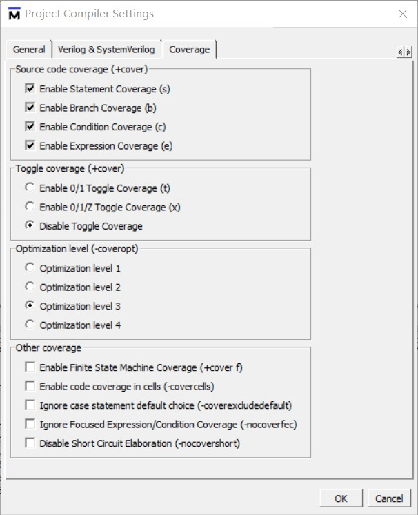
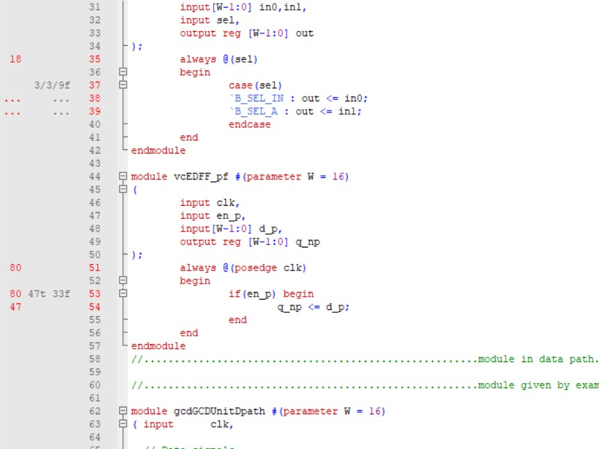

# modelsim中代码覆盖率使用详解

## 使用步骤

Modelsim代码覆盖率Code coverage，能报告出statement、branch、condition、expression、toggle、fsm等多种覆盖率情况。

1. 添加文件
   1. 新建项目
   2. 在项目中添加对应的代码，包括源代码和testbench代码。
2. 编译选项
   1. 选中需要查看代码覆盖率的文件，然后点击右键选择compile->compile properties。
   2. 选择“Coverage”选项，选择需要覆盖的信息（statement、branch、condition、expression和toggle等）
   
3. 编译：点工具栏中的编译，编译选中的文件，成功后进行下面的步骤。
4. 仿真
   1. 点击工具栏中的仿真按钮，选中对应的testbench文件（注意不要选择“Enable optimization”）
   2. 在others选项中选中“Enabel code coverage”
   
5. 完成以上操作后，便出现了代码覆盖率的窗口，点击“run/run-all”之后便可查看代码覆盖率

## 各子窗口介绍

1. Workspace窗口
   1. 文件
   
   2. 模块
   
2. 文件中语句覆盖情况
   1. 文件中包含Hits(statement hits)和BC(branch coverage)栏，显示覆盖情况。
   2. 选择Tool->Code Coverage->Show coverage number，便可显示语句或分支被执行的次数。
   
3. Exclusion
   1. 设置排除文件
      1. 选择对应文件，右键Code Coverage->Exclude Selected File
      2. 在Current Exclusion窗口中选中对应文件，Cancel Selected Exclusions
   2. 设置排出行
      1. 选择对应行，Exclude Coverage Line
      2. 取消同上

## 创建代码覆盖率报告

1. 选择Tool->Code Coverage->Reports
2. 根据设置各选项和报告存放路径。